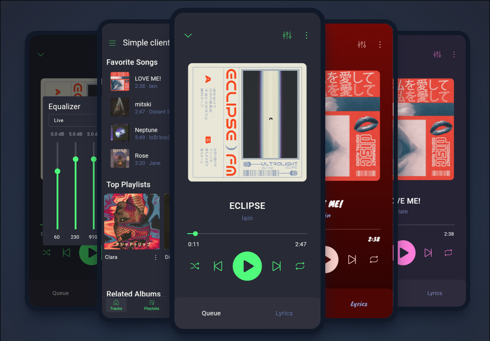
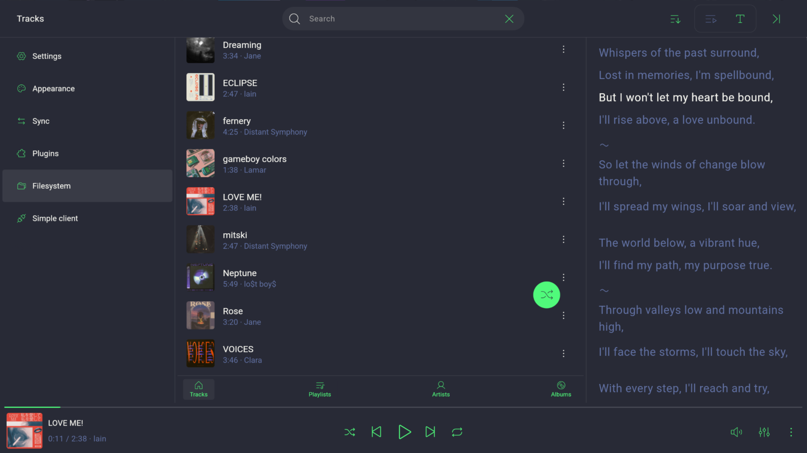
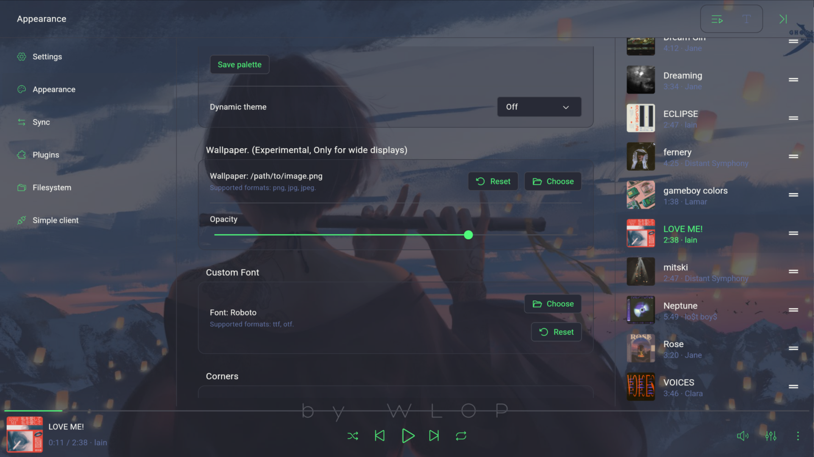
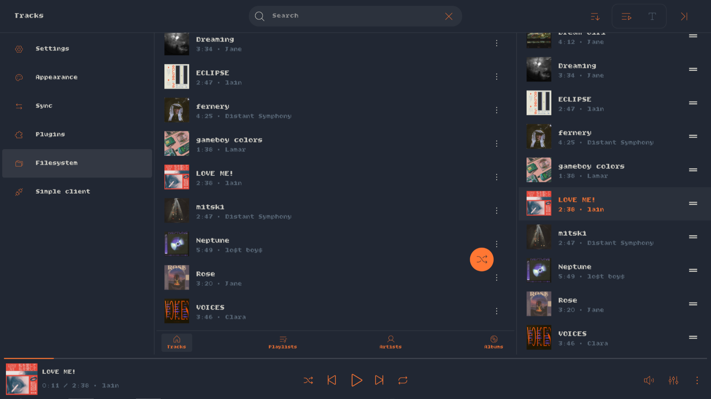
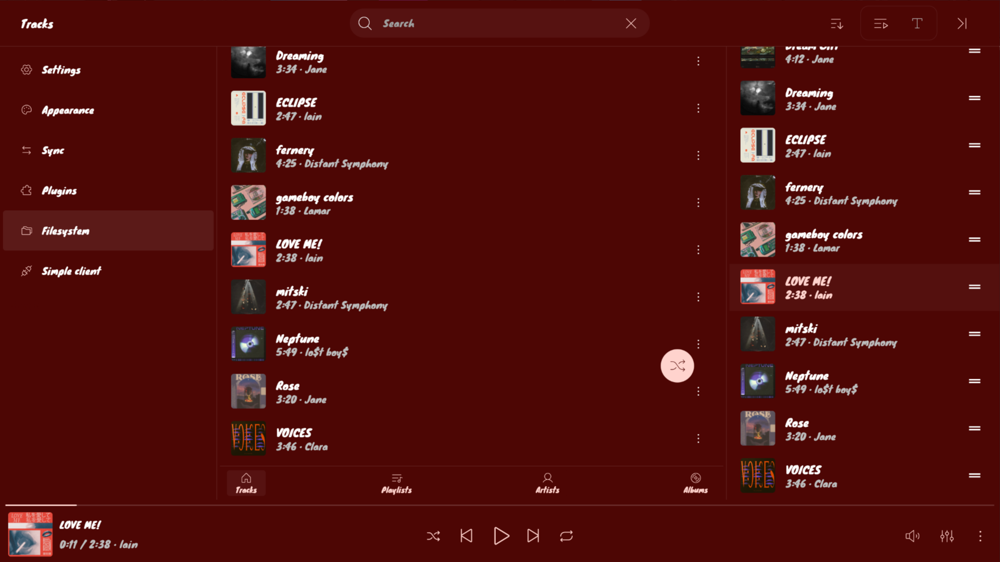
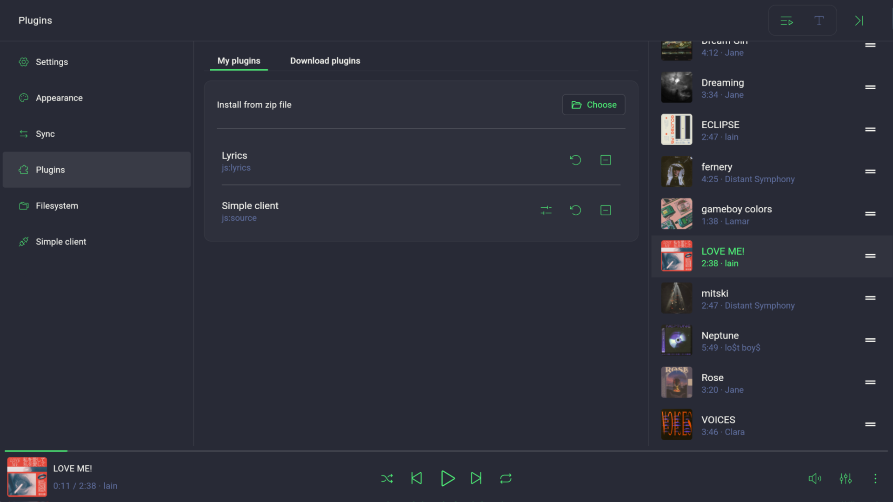
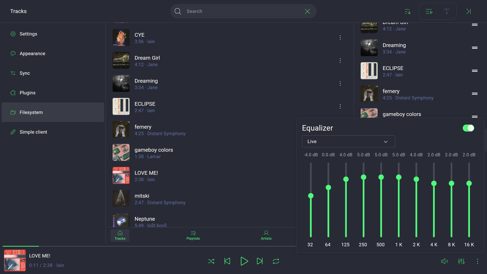

# LibreSound - Extendable music player

**LibreSound** is a music player that can be easily extended to get more features. **The plugin system** is like a lego set: you can add **new music** sources, **lyrics** and **functionality**. It's all up to you. No ads, no subscriptions; free & open-source.

Website: [libresound.org](https://libresound.org/).

## Features

- 🔌 **Plugins System:** Extendable functionality with plugins: new music sources, new lyrics, new functions.
- 📂 **Different Music Sources:** Play music from local storage or plugins, and seamlessly switch between them.
- 🔄 **Syncing:** Exchange your music and playlists between devices.
- 🎨 **Customization:** Use predefined color palettes or create your own.
- 🎤 **Lyrics Support:** Time-synced lyrics from your preferred plugin.
- 🎛️ **Equalizer:** Built-in audio Equalizer.
- 🎹 **Keybindings:** Customizable keybindings & shortcuts.
- 💻 **Cross-Platform:** Available for Android, Windows and Linux.
- 🚫 **Ad-Free:** No ads - no headaches.

## Downloads

- [Official Website](https://libresound.org/#Downloads)
- [Github releases](https://github.com/motobep/libresound/releases)

## Screenshots

#### Mobile



#### Desktop

**Lyrics via a Plugin**


**Custom Background Image**


**Customizable Colors, Fonts & Thumbnail corners**


**Dynamic Theme**


**Plugins**


**Equalizer**



## TODO

- [ ] Plugins via shared libraries (.so/.dll)
- [ ] App's Proxy settings
- [ ] Transparent/blurred background (PC)


## Dependencies

- Flutter 3.41.9
- Dart 3.11.5

## Build & Run from source

### Run

On Windows: set GSTREAMER_ROOT_X86 env variable before run.

```bash
just run # using just
flutter run --debug --dart-define=build_mode=dev # directly
```

### Build

On Windows: set GSTREAMER_ROOT_X86 env variable before build.

```bash
just build # using just
flutter build apk --dart-define=build_mode=prod --dart-define=datetime=YYYY_MM_DD–hh:mm # directly
```
